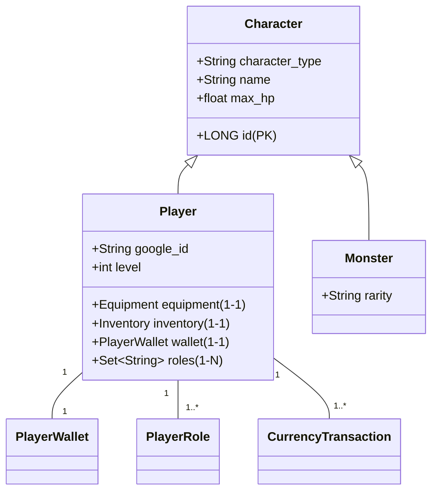
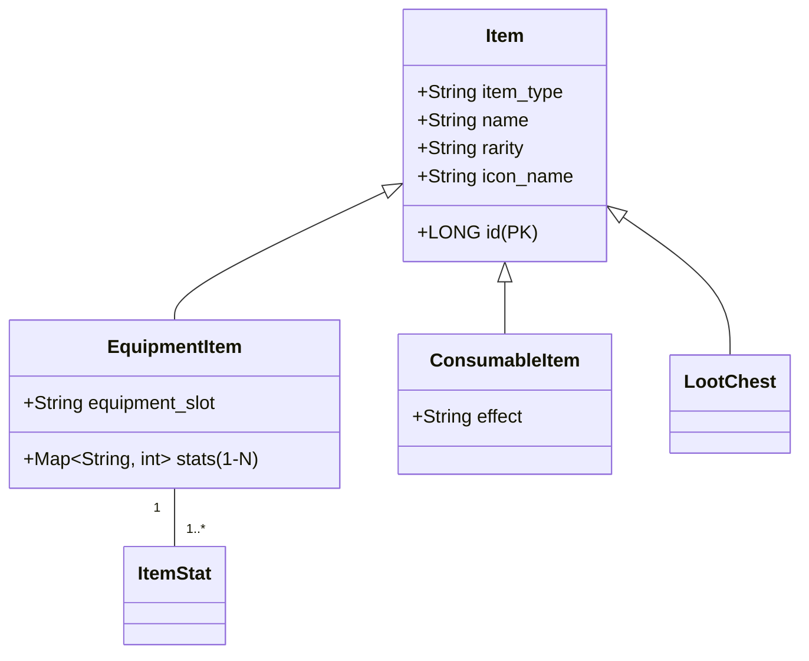
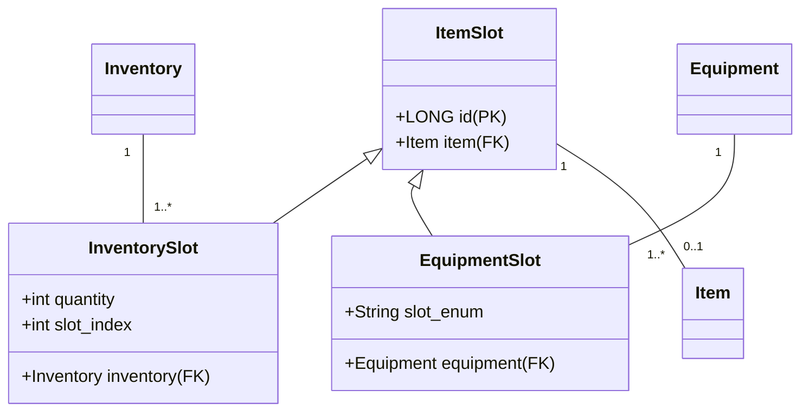
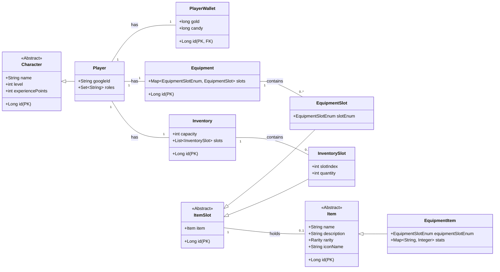

# CardGameOne - Backend

Willkommen zum Backend-Repository für **CardGameOne**, ein kartenbasiertes RPG. Dieses Projekt wird mit **Java**, dem **Spring Boot Framework** und **JPA/Hibernate** für die Datenbank-Interaktion entwickelt.

---

## 🚀 Features

* **Spieler-Management:** Authentifizierung, Speicherung von Charakterdaten, Rollen und Währungen.
* **Item-System:** Ein flexibles System für Ausrüstung, Verbrauchsgegenstände und Loot-Truhen mit Stats und Eigenschaften.
* **Inventar & Ausrüstung:** Persistente Verwaltung von Spieler-Inventaren und angelegter Ausrüstung.
* **Spiel-Logik:** Serverseitige Logik zur Verwaltung von Spielrunden, Monstern und Kapiteln.
* **Sicherheit:** JWT-basiertes Authentifizierungssystem zum Schutz der API-Endpunkte.

---

## 🏛️ Architektur: Datenbankstruktur

Das Herzstück des Backends ist eine relationale Datenbank, die den gesamten Spielzustand verwaltet. Die Struktur ist in drei Hauptbereiche unterteilt: **Charaktere**, **Items** und die **Slots**, die beide miteinander verbinden.

### Charakter-Schema

Spieler und Monster werden über eine `SINGLE_TABLE`-Vererbungsstrategie in einer zentralen `CHARACTER`-Tabelle verwaltet. Dies ermöglicht eine einfache Referenzierung von beliebigen Charakteren im Spiel.

* **CHARACTER:** Die Basistabelle für alle lebenden Entitäten.
* **PLAYER_ROLES:** Speichert die Berechtigungen eines Spielers (z.B. ROLE_USER, ROLE_ADMIN).
* **PLAYER_WALLET:** Verwaltet die Spiel- und Echtgeld-Währungen eines Spielers.
* **CURRENCY_TRANSACTION:** Ein detailliertes Logbuch jeder Währungstransaktion zur Nachverfolgung.

### Item-Schema

Ähnlich wie bei den Charakteren wird für alle Items eine SINGLE_TABLE-Vererbungsstrategie verwendet. Das macht das System extrem flexibel für zukünftige Item-Typen.

* **ITEM:** Die zentrale Tabelle für alle Item-Blaupausen.
* **ITEM_STATS:** Eine separate Tabelle zur Speicherung flexibler Stats für Ausrüstungsgegenstände.

### Slot-Schema (Das Bindeglied)
Um die Items mit den Spielern (über Inventar und Ausrüstung) zu verbinden, wird eine JOINED-Vererbungsstrategie verwendet. Dies sorgt für eine saubere und normalisierte Datenbankstruktur.

* **ITEM_SLOT:** Die Basis-Tabelle, die einen Slot als Konzept definiert.
* **INVENTORY_SLOT:** Eine spezialisierte Tabelle, die einen Platz im Inventar eines Spielers repräsentiert.
* **EQUIPMENT_SLOT:** Eine spezialisierte Tabelle, die einen Ausrüstungsplatz eines Spielers repräsentiert.
---
# Gesamtes InventarSystem

